# Awesome Financial Close Management 📊

  
  
  

## 🚀 Top Financial Close Management Platforms & Accounting Automation Ecosystem

> **Curated List of Enterprise SaaS Products & Open-Source GitHub Projects**  
> *Focused on Account Reconciliation, Month-End Close, Financial Checklists, Journal Entries, ERP Consolidation, Flux Variance Analysis & Audit-Ready SOX Controls*  
> **Last updated: September 2026**

---

## 💡 Overview & SEO Summary

**Financial Close Management** software automates and streamlines period-end accounting operations, enabling corporate controllers, accounting teams, and CFO offices to close the books faster while maintaining audit compliance. Core features include:

- 📑 **Account Reconciliation**: Automated transaction matching between general ledgers (GL), sub-ledgers, bank statements, and payment gateways.
- ⏱️ **Month-End Close Workflow**: Dynamic task checklists, dependency tracking, role-based approvals, and sign-offs.
- 📝 **Journal Entry Automation**: Automated recurring journal postings, review workflows, and ERP audit trail logging.
- 🔍 **Flux & Variance Analysis**: AI-assisted period-over-period financial line-item variance explanations.
- 🛡️ **Governance & Audit Compliance**: SOX compliance evidence packages, internal control monitoring, and auditor access portals.

---

## 📋 Table of Contents

- [🏢 SaaS & Enterprise Platforms](#-saas--enterprise-platforms)
  - [📊 Industry & Market Overview](#-industry--market-overview)
  - [💼 SaaS Comparison Matrix](#-saas-comparison-matrix)
- [💻 Open-Source GitHub Projects](#-open-source-github-projects)
- [🤝 How to Contribute](#-how-to-contribute)
- [❤️ Support & Sponsorship](#%EF%B8%8F-support--sponsorship)
- [📈 Star History](#-star-history)
- [⚠️ Disclaimer](#%EF%B8%8F-disclaimer)

---

## 🏢 SaaS & Enterprise Platforms

### 📊 Industry & Market Overview

> **Market Size & Structure**: The global Financial Close and Consolidation Management software market is estimated at **$3.8 Billion - $4.5 Billion (2026)** and is projected to reach **$7.2 Billion by 2030** (CAGR ~11.5%). 
> 
> **Market Fragmentation**: The sector is **moderately fragmented**. High-end enterprise accounts are anchored by legacy ERP giants (Oracle, Workiva, BlackLine, OneStream), while modern mid-market enterprise workflows are rapidly being captured by agile, AI-first category leaders (FloQast, Numeric, Trintech).

### 💼 SaaS Comparison Matrix

| Product Name 🏢 | Valuation / Market Size 💰 | Pricing Model & Starting Tier 🏷️ | Free Tier / Trial Limit 🎁 | Description & Core Focus 🎯 |
| :--- | :--- | :--- | :--- | :--- |
| **[Oracle FCCS / Account Reconciliation](https://www.oracle.com/)** | **$450+ Billion** (Public: ORCL Market Cap) | Custom Enterprise (~$80 - $120/user/month billed annually) | 30-day Free Trial (Oracle Cloud Free Tier with $300 credits) | Enterprise-grade EPM solution for global consolidation, multi-ERP reconciliation, and complex regulatory reporting. |
| **[Workiva Close](https://www.workiva.com/)** | **$4.5+ Billion** (Public: WK Market Cap) | Custom Enterprise (~$10,000+/year base tier) | Demo on request; No free trial (14-day sandboxes available for enterprise evaluations) | SEC-compliant connected reporting, close collaboration, governance, and audit readiness platform. |
| **[BlackLine](https://www.blackline.com/)** | **$3.5+ Billion** (Public: BL Market Cap) | Custom Enterprise (~$1,000/user/year base enterprise tier) | Guided Interactive Sandbox Demo; No permanent free tier or public free trial | Industry standard cloud platform for account reconciliations, journal entry management, and automated intercompany close. |
| **[OneStream](https://www.onestream.com/)** | **$6.0+ Billion** (Public: OS Market Cap) | Enterprise License (~$100,000+/year core platform contract) | Guided Enterprise Sandbox / Demo on request; No self-serve free trial | Unified CPM software combining financial close, financial consolidation, FP&A planning, and operational reporting. |
| **[FloQast](https://www.floqast.com/)** | **$1.6+ Billion** (Private - Series E Unicorn) | Custom Mid-Market (~$900/month or ~$10,000/year starting team package) | 14-day Free Trial available upon sales consultation | Accountant-centric close management workflow tool built around Excel integration, task tracking, and ERP sync. |
| **[Planful](https://planful.com/)** | **$500+ Million** (Private - Vector Capital Backed) | Custom Annual Subscription (~$15,000/year starting tier) | Interactive Product Tour & Demo on request; No self-serve free trial | Continuous financial planning, automated month-end close, FP&A, and financial reporting platform. |
| **[Trintech (Adra / Cadency)](https://www.trintech.com/)** | **$500+ Million** (Private - Summit Partners Backed) | Custom (~$500 - $750/user/year depending on Adra vs Cadency suite) | 14-day Free Trial for Adra Suite upon request | Financial close automation for SMBs (Adra) and complex global enterprises (Cadency). |
| **[Numeric](https://www.numeric.io/)** | **$150+ Million** (Private - Founders Fund / Series A) | Free Tier available; Paid plans start at $300/month | **Free Forever Plan** available for small teams (includes month-end task management & basic flux analysis) | Modern AI-native close platform emphasizing automated account reconciliations, flux commentary, and close checklists. |
| **[SolveXia](https://www.solvexia.com/)** | **$30+ Million** (Private / Bootstrapped) | Standard Tier starts at ~$450/month | 14-day Free Trial with sample data transformation pipelines | Process automation and reconciliation platform for data matching, task scheduling, and audit trail creation. |

---

## 💻 Open-Source GitHub Projects

Below is a curated list of open-source projects, ERP modules, ledger engines, and reconciliation tools for financial close operations, sorted by GitHub Star Count (descending) 🌟:

1. **[Odoo](https://github.com/odoo/odoo)**  
    🌟  
   *Comprehensive open-source ERP suite featuring robust double-entry bookkeeping, automatic bank feed reconciliations, closing entry management, and financial reporting.* 📑

2. **[Frappe / ERPNext](https://github.com/frappe/erpnext)**  
    🌟  
   *Full-featured open-source enterprise ERP with built-in Period Closing Vouchers, bank reconciliation tools, ledger control, and automated accounting workflows.* ⚙️

3. **[Firefly III](https://github.com/firefly-iii/firefly-iii)**  
    🌟  
   *Self-hosted financial management system offering automated rules engine, transaction matching, budget verification, and period summary reports.* 💰

4. **[Beancount](https://github.com/beancount/beancount)**  
    🌟  
   *Double-entry plain text accounting tool allowing programmable transaction matching, custom balance sheet assertions, and period-close verification scripts.* 📝

5. **[hledger](https://github.com/simonmichael/hledger)**  
    🌟  
   *Robust, cross-platform plain text accounting suite designed for multi-currency financial balance audits and period-end trial balance reports.* 📊

6. **[Apache Fineract](https://github.com/apache/fineract)**  
    🌟  
   *Open-source core banking and financial services platform with enterprise sub-ledger closure features, portfolio reconciliation, and regulatory audit logging.* 🏦

7. **[Akaunting](https://github.com/akaunting/akaunting)**  
    🌟  
   *Modular open-source accounting software built for small businesses, offering expense reconciliation, financial reports, and period closing controls.* 🛠️

8. **[Kill Bill](https://github.com/killbill/killbill)**  
    🌟  
   *Open-source subscription billing and payment platform with automated revenue recognition matching, payment reconciliation, and ledger export.* 💳

9. **[OPN Reco](https://github.com/OpenPaymentNetwork/opnreco)**  
    🌟  
   *Open-source payment network reconciliation tool specialized in matching payment processing records, settlement files, and bank statements.* 🔄

---

## 🤝 How to Contribute

Contributions are very welcome! 🚀 Help us keep this financial close management ecosystem up to date.

1. 🍴 **Fork** the repository on GitHub.
2. 📝 **Add or edit** entries in `README.md` following the tabular or badge format.
3. 🔗 Ensure all SaaS platforms include exact pricing/limits and open-source projects include official stargazer links.
4. 📥 Submit a **Pull Request** with a brief summary of your changes.

Reference list guidelines: [Awesome List Guidelines](https://github.com/ishandutta2007/Awesome-Awesome-Awesome).

---

## ❤️ Support & Sponsorship

If you find this repository helpful for your accounting transformation, finance ops stack research, or software engineering projects, please consider supporting! 💖

- ⭐ **Star** this repository to increase visibility.
- 🔄 **Share** with controllers, FP&A leads, and fintech engineers.
- ☕ **Buy me a coffee**: Support ongoing open-source curation on [GitHub Sponsors](https://github.com/sponsors/ishandutta2007).

---

## 📈 Star History

---

## ⚠️ Disclaimer

- This list is **community-curated** for research purposes and does not constitute an endorsement.
- Financial close tools touch critical general ledger data and financial reporting compliance. Always verify internal controls, audit trails, and security standards before deploying solutions in a production accounting environment.
